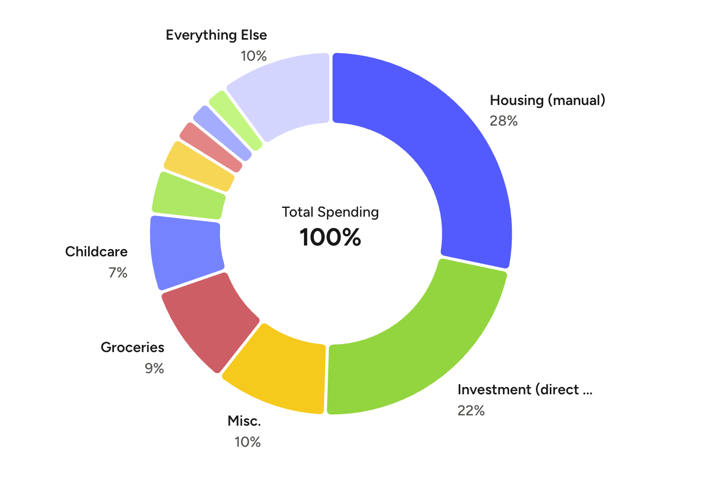

# Budget breakdown

Here's a pie chart breakdown of our year-to-date household spend. We're in December, so this is essentially what we've 
spent in the year 2025.

Maybe at some point in the future I'll get more comfortable with complete transparency of our finances to strangers on
the internet, but for now, I've decided to express all values as percentages.

Looking at the top 3 categories, sorted by spend, we've got:

1. __Housing__: our mortgage. A couple of things to note here:
   - Our housing cost is always our biggest expense, which is probably true for most.
   - It's also our most _inflexible_ expense, i.e. there's very little we can do to lower our monthly payment. We were 
     very lucky and were able to snag a really low rate (2.875%) during the record low interest rate environment in the 
     summer of 2021, so a re-finance now would be a _terrible_ idea.

2. __Investment__: this is the amount of take-home pay that we're able to put into both tax-advantaged and 
   nontax-advantaged investment accounts.
   - In general, this is going to be the number that we try to maximize by reducing spend in other areas.
   - We're tremendously fortunate to have money left over to do this, of course.

3. __Misc.__: the _dreaded_ catch-all category that I'm trying to improve observability on.
   - Most Amazon purchases will go in this category, but that can be all kinds of things: cleaning supplies, clothing, 
     juice, batteries, etc.

# 10% of our annual spend!

That's right. One-tenth of our yearly spend goes to this mysterious Misc. category!

In my on-paper budget, I only have 1.5% of our budget allocated to Misc., so we're overspending on that category by _quite_
a bit. 

Just to put that into perspective, if we reduced our spending in Misc. to what I _actually_ have allocated for it each month,
we could reduce our time to FIRE by almost __2 years__.

Obviously, that's very optimistic and maybe just a touch unrealistic. After all, neither my wife nor I are extravagant
spenders so, it stands to reason, that everything we overspent on is something that we probably needed.

But the point is that we don't really have any data to back this up.

So, to summarize, I hope my investigations during this series will:

1. More precisely indicate what we're spending our money on in "Misc."
2. Give us a framework to prioritize, defer or cancel purchasing decisions in a more systematic way.
3. Capture Amazon purchases (of which there are many) in higher fidelity.
   - This is a particular annoyance of mine. We do a lot of shopping on Amazon, but a combination of how they group their
     transactions on the credit card statement and YNAB's _painfully basic_ memo feature leads to very poor visibility on
     what we've bought and our overall spending patterns.
