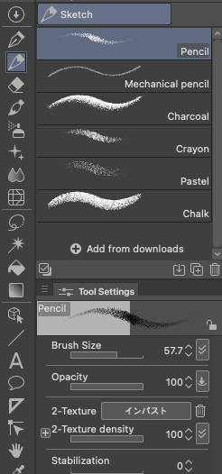
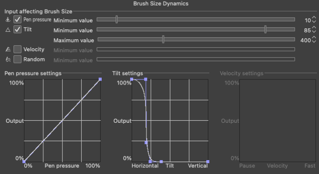
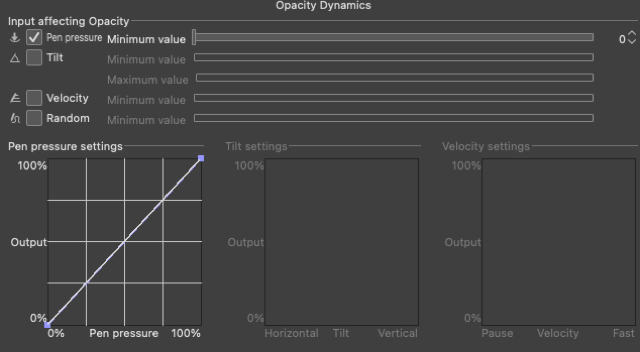

<!-- cover image once captured: a strip showing all 4 stroke styles side by side -->

Every recipe below is the same idea applied four different ways: pick a property, decide which input drives it
(pressure, tilt, or velocity), and decide how far that input is allowed to push it. That's the whole per-brush
__Dynamics__ system, and one setting inside it, Minimum Value, comes up in every recipe below. If you haven't run
into it before, [What Does "Minimum Value" Mean in Clip Studio Paint?](/clip-studio-paint-minimum-value/) covers
what it actually controls. I'm not re-explaining the mechanics here, just pointing at exactly which knob produces
each look and why.

Treat every number below as a starting point, not a tested constant. Your tablet's own pressure curve, your
brush's base size, and your hand all shift where these land, so nudge by eye once you're in the ballpark.

## 1. Ballpoint pen

__The look:__ a mostly flat, consistent line that barely reacts to how hard you press, the way an actual
ballpoint does, but not perfectly rigid: real ballpoint strokes still show a hair of taper right where the pen
first touches down and where it lifts off.

__The setting:__ focus on brush size here, not Minimum Value. Set the brush itself small, around 2-4px, and leave
pressure linked to Size like normal. Minimum Value barely matters at this scale, even at 0 it still reads as a
ballpoint with a small natural taper.

__Why it looks like this:__ Minimum Value is a percentage of the brush's configured size, not a fixed pixel
amount. On a 50px brush, the gap between Minimum Value 0 and 100 spans dozens of visible pixels. On a 3px brush,
that same percentage range is a fraction of a pixel, too small for CSP to render as a visible difference no
matter where you set it. So a thin brush looks "pressure-insensitive" almost by default, and the sliver of taper
you do see at the start and end of a stroke is really just the pen making initial contact and lifting off, not
something Minimum Value is doing. See [the Minimum Value post](/clip-studio-paint-minimum-value/) for what that
setting is actually doing at brush sizes where it's big enough to matter.

## 2. Japanese brush calligraphy

__The look:__ thick, confident strokes that taper to a fine point, the kind you get from an angled brush pen.

__The setting:__ I'm going to be using the Turnip pen here (to keep all variables as consistent as possible), but you'd 
typically use a brush with a flat or angled tip for this style. 

Open Brush Size Dynamics and link size to __Tilt__ instead of Pressure, with Minimum Value near 0 so the full range 
is available. The more you lay the pen down, the wider the stroke.

__Why it looks like this:__ calligraphy's characteristic taper comes from the angle of a real brush or nib
changing how much surface touches the page, not from how hard you press. Tilt is the input that maps to that
directly. Pressure can still be layered on top for extra expressiveness, but tilt is what's actually doing the
calligraphic work here.



## 3. Graphite pencil sketch

__The look:__ soft, buildable shading where light passes barely show up and pressing harder darkens the area,
closer to how graphite actually behaves on paper.

__The setting:__ start with the Sketch category's __Pencil__ brush, since its built-in texture already reads as
graphite. Then wire up two Dynamics panels at once. Link __Tilt__ to Brush Size with a wide range, something like
85% to 400%, so laying the pencil flatter fattens the stroke the way the flat edge of a real pencil does, and keep
Pen pressure's own Minimum Value low (around 10) so pressure barely shrinks the line back down on its own.
Separately, link __Opacity__ (or Density) to Pressure with Minimum Value at 0, so a light pass stays faint and a
hard pass builds all the way up to full strength.

__Why it looks like this:__ this splits the two things a real pencil does into the two inputs that actually
control them. Tilt driving Size mimics how laying a pencil flatter widens the mark, while Pressure driving Opacity
gives you the value control (how dark) that pressing harder adds on real paper. Layer both dynamics on the same
brush and a single stroke can drift from a faint, narrow hint to a wide, dark mark without you touching the brush
size slider.



  
  

    
    
  



## 4. Dip pen / nib line

__The look:__ a line that starts thin, swells confidently through the middle of a stroke, and snaps back to a
point at the tail, the classic ink-nib flick.

__The setting:__ link Brush Size to Pressure like normal, but this time go into the __pressure curve__ inside
that Dynamics dialog and reshape it instead of just moving Minimum Value: pull the low end down so light contact
barely registers, then let it rise steeply through the middle.

__Why it looks like this:__ Minimum Value only sets the floor and ceiling of the range. The *shape* of the curve
between those two points is a separate thing you can edit directly, and it's what decides how quickly the line
fattens as pressure increases. A steep curve gives you a fast, confident swell instead of a gradual one, which is
what a real nib's flex feels like.


If these recipes save you some trial and error, buying me a coffee helps keep posts like this coming.


## Quick reference

| Look | Property changed | Input |
|---|---|---|
| Ballpoint pen | Size | small brush size, Minimum Value barely matters |
| Brush calligraphy | Size | Tilt |
| Pencil sketch | Opacity | Pressure |
| Dip pen | Size | Pressure curve shape |

Four looks, but really only three moves: which property you're driving, which input drives it, and how far you
let that input push it. Once you can name those three things for a brush you like, you can reverse-engineer
pretty much any pressure-based look you run into.
