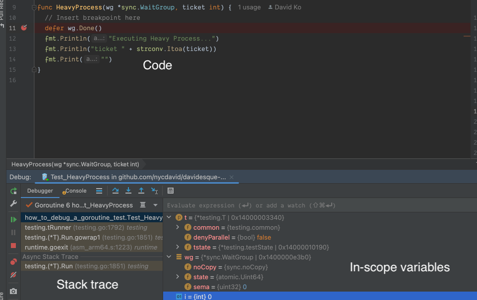

## Quick note about editors/IDEs

With Go, my philosophy on editors vs. IDEs vs. whatever else is this: if your current setup won't allow you to: 

- easily add breakpoints
- granularly step through code line-by-line and 
- dive in to and out of function calls

You're making your life unnecessarily difficult, at least as far as writing Go is concerned. Debugging sequential
code without a way to pause execution is hard. Trying to debug _concurrent_ code without it: you're going to have
a bad time.

The boost in productivity you'll experience immediately by using breakpoints rather than print statements and just 
trying to read the code and make sense of it in your head will be __drastic__.

Luckily, most editors and IDEs (vim, VS Code, etc.) coupled with the right plugins and tooling should get you there. 
It's so easy that, really, there's no reason not to use them.

That being said, my example below will be using the Jetbrains GoLand IDE but the ideas should translate to other 
editors as well.

## Using breakpoints

A breakpoint will pause execution of all code that's running at the moment in which any process gets to the defined
breakpoint. Once the code is paused, the debugger will allow you to examine any variables and objects that are in scope
at that point in time.

When I'm debugging code that uses goroutines, I'll place breakpoints in _at least_ the following 2 places:

1. The latest point _before_ any goroutines are created. This is typically the  line right before an invocation of 
  `go func(...) {...}()`
2. The first line of the goroutine'ed function.

Breakpoints in these 2 places will allow you to:

- Examine the state of the world _before_ any concurrent code has run.
- Examine the state of the world _as_ concurrent code is running.[^1]

The following is how that looks in GoLand:
  

## Using `GOMAXPROCS`

`GOMAXPROCS` is an environment variable that the runtime looks at to determine how many goroutines it will allow to 
make simultaneous progress at any one time i.e. if you set `GOMAXPROCS=1`, only one goroutine can make progress at a 
time.

It's important to note the nuance in the statement above: even if `GOMAXPROCS=1`, it _does not_ mean that one goroutine
will be scheduled and run to completion, uninterrupted. Due to Go's preemption[^2] the 1 goroutine that gets scheduled 
can be swapped out for another goroutine at any time. 

With `GOMAXPROCS=1`, the only guarantee is that the number of concurrently executing goroutines will be less than or 
equal to that number.

Still, tweaking this environment variable can be immensely useful when used with breakpoints to make the execution of 
your code more predictable.

[^1]: It's important to note that a breakpoint is _still_ not a guarantee of sequential code. Assuming that will very
likely lead to incorrect deductions about your code's behavior.

[^2]: Pre-emption is the runtime’s ability to forcibly pause a running goroutine so others can make progress.
