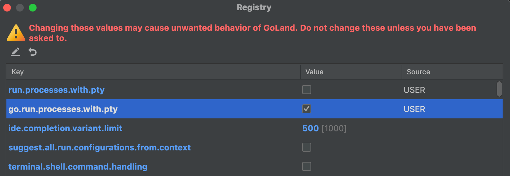

If you've tried to run TUI-based apps in GoLand for debugging purposes, you may have seen the following error:

```bash
error: could not open a new TTY: open /dev/tty: device not configured

Process finished with the exit code 1
```

In order to get GoLand to be able to run TUI programs correctly, you need to make the following changes:

## The Registry

1. Go to the Registry
   - Find this under __Search Everywhere__ (Double Shift) `->` __Actions__ `->` __Registry__
   

2. Enable `go.run.processes.with.pty`
    

##  Build configuration for `main`

1. Lastly, go to the build configuration for the `main` package you're trying to run and do 2 things:
   - Enable __Emulate terminal in output console__
   - Add the `TERM=xterm-256color` environment variable
   
