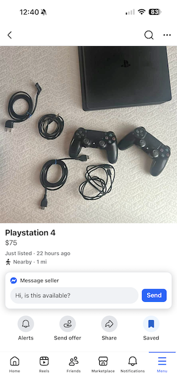
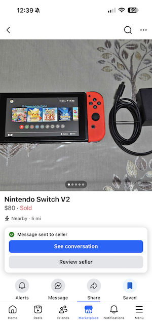
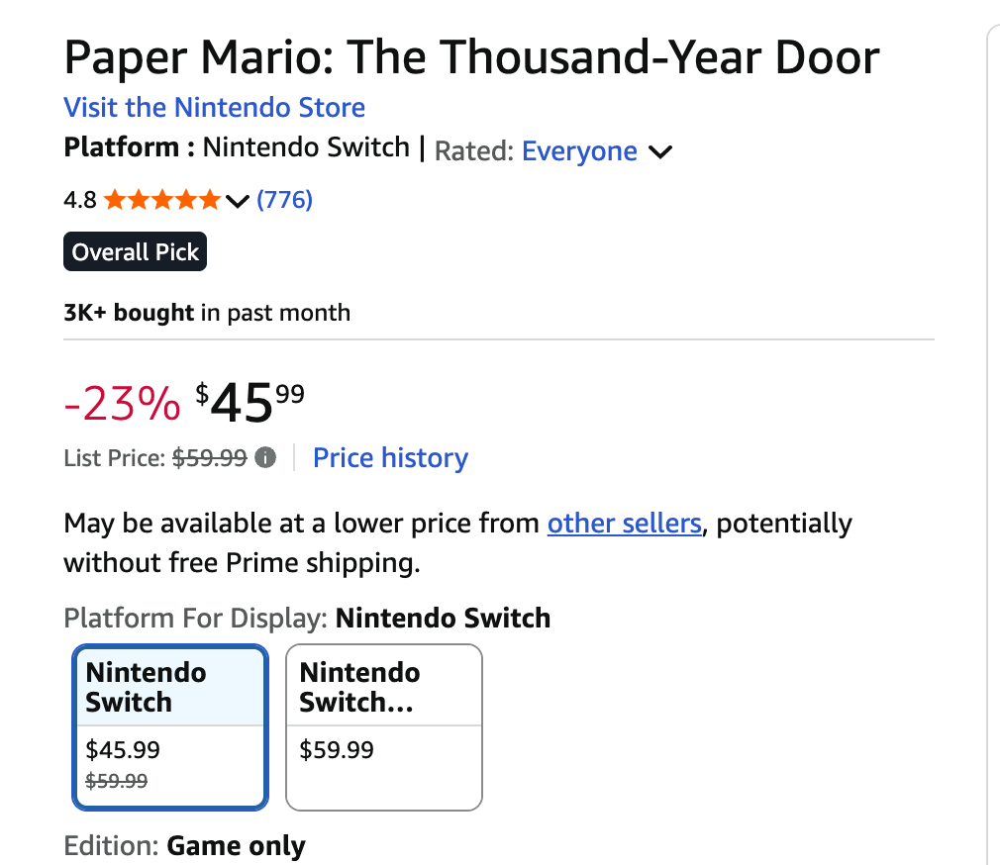
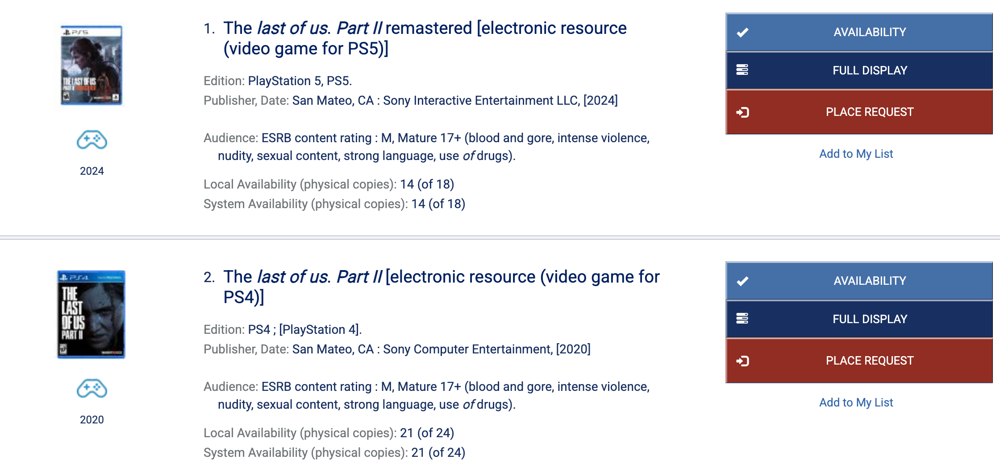

Video games can be really fun and a great way to spend time with your kids.

# Step #1: Pick up a console second hand (and, preferably, a generation back)

We're busy parents. Most of our gaming time, if it's just us, is going to be later at night, after the kids have been 
put to bed. We don't need the cutting edge, latest console brand new on launch day.

We'll do just fine with a second-hand machine that has some mileage on it. We can cut cost even more by picking up a 
console that's a generation back, too. The latest Playstation, as of this writing, is the PS5. Brand new, this thing 
costs $500.

Alternatively, I found this PS4 + 2 controllers on Facebook Marketplace for $75. Awhile back, I also bought a 
Nintendo Switch for $80.

The reason why picking up a Playstation or Nintendo Switch one generation back isn't as bad of a deal as you might 
think is because a lot of developers, during the intermediate period when a new console has been released but the 
previous generation console is still popular, will __release the game for both__.

For instance, the highly popular franchise [The Last of Us](https://en.wikipedia.org/wiki/The_Last_of_Us) released 
Part I of the series for Playstations 3, 4 and 5! Part II had both PS4 and PS5 ports.

So let's say you really, _really_ wanted to play The Last of Us, Part I and didn't own any Sony consoles. Sure you could 
fork over $500 for a new PS5 or, at a minimum, $200 for a used one, if you really wanted to. Orrrr you could hunt for a 
used PS3 or PS4 at a fraction of the price, while still enjoying 80-90% of the experience. Kind of a no-brainer, if you
ask me.

## Graphical differences

> But what about the improved graphics of newer-gen systems? I want to play my video games on the best hardware!

This article is aimed at, what I believe to be, the vast majority of busy parents that want to enjoy an hour or two
of a good video game and who understand the sliding scale between "good enough" and affordability.

Although I sympathize, this is _not_ for the power gamer parents that notice framerates, shading, minute differences in 
color and all the other improvements that come with a step-up in generation.

To those parents: by all means, spend the money on the PS5. It'll be worth it to you, and that's ultimately what this
is about.

# Step #2: Make a membership at the library

## High price of games

Let's cut to the chase here: not only are consoles expensive but _so are games_. I recently wanted to make the rounds 
and play all the older Nintendo exclusive titles that I missed in my 20s and 30s and landed on 
[Paper Mario: The Thousand-Year Door](https://en.wikipedia.org/wiki/Paper_Mario:_The_Thousand-Year_Door), which had a 
re-release on the Nintendo Switch.

I thought "Great! I've got a Switch that I got a great deal on it. Let's put it to use!"

The only problem? The game is $45! $60 to get the digital version from Nintendo! More money for less stuff 
(case, booklet, etc.)? How does that make sense?

I looked on FB Marketplace first but couldn't find that great of a deal on it, since it hasn't been all that long 
since Paper Mario was released on the Switch. Also, incidentally, I've noticed that Nintendo Switch games, by and large, 
hold their value remarkably well. Maybe because they're exclusives?

In any case, I was quite leery about paying that much for something that I'd enjoy every once in a while, but would 
otherwise not be a huge part of my life.

## The Library!

My local library rents video games! Also, the library is a part of a network of 70 or 80 libraries that have an 
internal transportation/delivery system. You can find the item you're looking for in any one of the member libraries and
have it delivered it to your local library for pickup.

Look at what I get when I search for The Last of Us, Part II on my local library's website:

Membership to the library is free, and you can rent whatever you want from it at no additional cost!

If my local library has it, I can reserve it online and go pick it up that day. If it doesn't, I can request it from 
another member library, wait a business day or two to have it delivered, and go pick it up then.

---

I'd say combined with these 2 tips, there really shouldn't be any reason why most parents aren't able to enjoy playing
video games (by themselves or with their kids) without breaking the bank.
