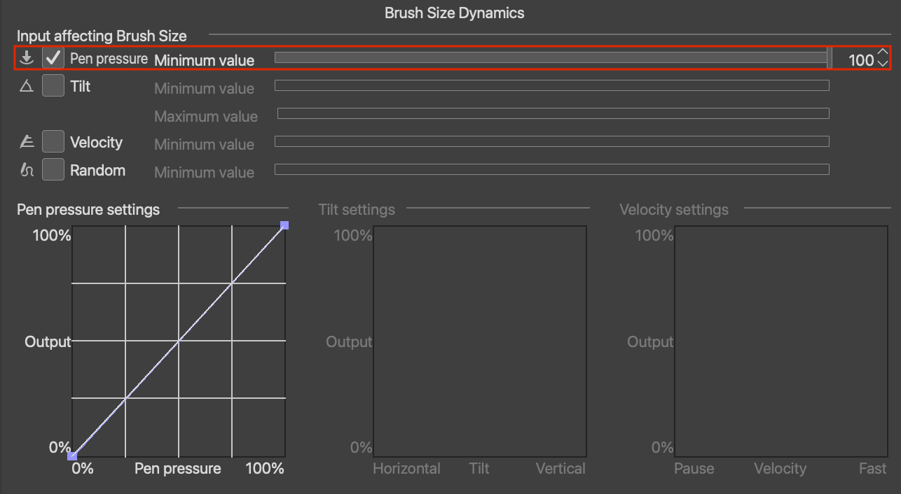
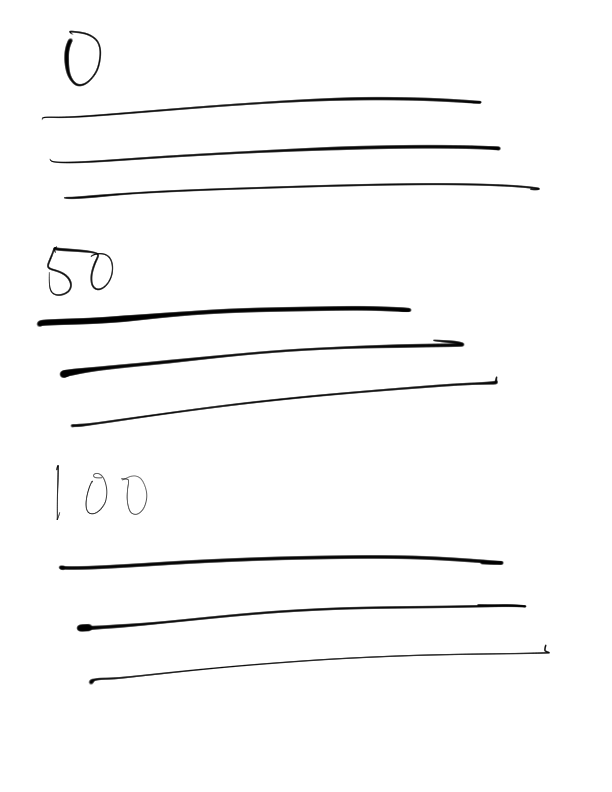
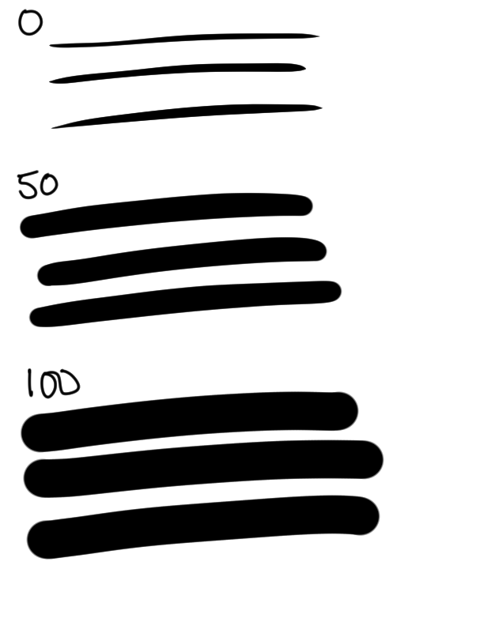

If you've poked around the Sub Tool Detail panel in Clip Studio Paint, you've probably run into a setting called 
__Minimum Value__ tucked under __Brush Size__ (or __Thickness__, __Density__, __Opacity__, depending on which slider 
you're looking at). 

And if you're like me, you took one look at that name and assumed you already knew what it did.

I didn't. Here's the mistake I made, and what the setting is actually doing.

__In short:__ Minimum Value controls the lowest output a brush property can reach when an input such as pen pressure is 
at its minimum. For Brush Size, Minimum Value represents the "floor" of line thickness. When clamped at 0, brush size
can range from very thin all the way to the configured brush size (the max). At 100, the minimum and maximum thickness
is the brush size you have configured, so pen pressure doesn't change thickness.

## The mistake: assuming it was a pressure threshold

I assumed __Minimum Value__ was the minimum amount of *pressure* required for the pen to leave a mark at all. 
Like a threshold: press lighter than this, and nothing shows up on the canvas.

That mental model made sense to me because it's roughly how a lot of real-world drawing tools behave. You need some 
baseline amount of force before a pencil or marker actually deposits anything. So when I saw a "Minimum" setting sitting 
right next to pressure-sensitive sliders, I figured it was a pressure threshold: a cutoff below which the pen stops 
registering.

Which is not at all what it does.

## What Minimum Value actually means

__Minimum Value__ sets the lower bound for how much that property can be reduced by the selected input, such as pen 
pressure. It doesn't gate whether a stroke appears. It sets the floor of how thin, how transparent, or how sparse a 
stroke can get *even at the lightest pressure applied*.

For Brush Size, Minimum Value is a percentage of the brush size you've configured. If your brush is set to 50 px and 
Minimum Value is 50, then at the minimum pressure input the brush-size floor is 25 px. A Minimum Value of 100 keeps the 
brush at the full configured size.

Other dynamics like tilt and velocity can influence the same property too, so the final stroke may still be affected by 
more than pressure alone.

__Minimum Value__ doesn't answer "will I make a mark?" It answers "how small can that mark be allowed to get?" And 
that's not an absolute guarantee either: things like your tablet's activation threshold, or a very low opacity/density 
elsewhere in the brush settings, could still make an extremely light touch effectively invisible. Minimum Value doesn't 
guarantee visibility. It's just not the "minimum pressure required to register" setting I originally assumed it was.

- __Minimum Value at 0__: the lightest input produces the thinnest/faintest possible line, potentially so faint it's barely visible.
- __Minimum Value at 100__: the input stops mattering at all for that property. Every stroke comes out at full size/opacity/density regardless of how hard you press.
- Anything in between sets a floor somewhere between those two extremes.

For brush size specifically, I think of it like compressing the lower end of the available size range. It's not that 
CSP is literally transforming your pressure input, just that it won't let the *output* drop below whatever floor 
you've set.

## Why my initial pressure test gave inconsistent results (tilt was interfering)

Before I settled on a clean test, I ran one that gave me confusing results, and the reason why turned out to be its own 
useful lesson.

I was testing with the Turnip Pen (my sketching pen of choice), and I had tilt enabled as an input affecting brush size, 
on top of pressure. So when I varied pressure and watched the line width change, I was actually seeing the *combined* effect of pressure and tilt, 
not pressure alone. Since CSP lets multiple inputs drive the same property simultaneously, my "pressure test" wasn't 
really isolating pressure.

As you can see, there isn't much that can be deduced here. Pretty confusing.

Once I disabled tilt as an input for brush size and left only pressure active, the results got a lot more consistent 
with my understanding of minimum value. That's the setup I used for the real test below.

## The 0/50/100 test

With tilt removed as a variable, I ran the test again. Same brush, brush width (50px), pressure curve, and stroke. I dragged 
the pen across the tablet at a light, consistent pressure three times, changing only __Minimum Value__ between passes.

- __0__: the stroke can potentially be razor thin here. Realistically, the inconsistent pressure from your hand will
  affect things a lot at this level but we can just think of it as theoretically possible minimum.
- __50__: the stroke never gets thinner/fainter than about half of max, even at that same light pressure.
- __100__: pressure sensitivity is essentially neutralized for that property. Regardless of pressure applied, every 
  stroke is 50px

That's the moment it clicked for me: at no point did the line fail to appear, even at 0. The pen was never "not 
registering." What changed was how much room there was between the thinnest possible mark and the thickest one.


If this saved you some head-scratching, buying me a coffee goes a long way toward keeping posts like this coming.


## What Should You Set Minimum Value To?

Once I understood it as a floor instead of a threshold, a few things I'd been fighting with started making sense:

- If your brush feels like it "disappears" on light passes, your __Minimum Value__ might be too low: 
  raise it so regardless of how much pen pressure is applied, the width can't go below a certain value.
- Likewise, if you want maximum pressure sensitivity (thin, tapering, expressive lines), you want __Minimum Value__ low, 
  closer to 0. This expands the left and right bounds of possible line thickness.
- If you want a brush that behaves more like a marker regardless of hand pressure, push __Minimum Value__ up toward 100. 
  This tightens the bounds of the line width.

It's a small setting, but it can introduce a lot of subtlety and nuance to your linework. It's definitely worth 
experimenting with on your own brushes to find settings that you're happy with.
